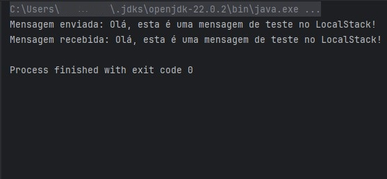

## AWS SQS Queue with Java

## About
This project demonstrates how to integrate [AWS SQS](https://aws.amazon.com/pt/sqs/) running on [LocalStack](https://www.localstack.cloud) with a **Java Maven** application. The project consists of two main components: a **producer** that sends messages to the SQS queue, and a **consumer** that reads and deletes messages from the queue.

## Getting Started

### Setup

1. Docker 4
2. LocalStack CLI or Desktop
3. Java 21
4. OpenJDK 22
5. Maven 4.0
6. A clone of the repo
    ```
   git clone https://github.com/isaac-conceicao/sqs-queue.git
    ```

### Running

1. Launch a new LocalStack container making sure SQS is enabled.
    
2. Get to the container CLI and create a queue:
   ```
   awslocal sqs create-queue --queue-name my-queue
   ```
3. I will return an URI `localhost.localstack.cloud:4566/000000000000/my-queue
   `, make sure to copy it.

4. Go to the project to edit the ``src/main/java/devtrail/java/sqsqueue/Main.java`` file

5. Set ``QUEUE_URL`` string value to the URI from step 3.

6. Save the edition and run the application.

If everything works you will see something like this:



---

**Happy coding!**


